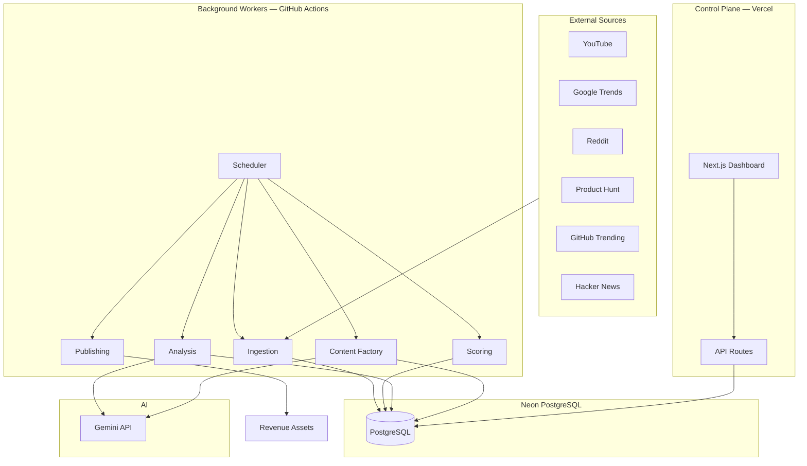

# AUTOPILOT MEDIA ENGINE — Architecture

This document defines how the system is structured, deployed, and extended. It is the technical source of truth. See [PROJECT_VISION.md](./PROJECT_VISION.md) for why we build this way.

---

## System Overview

Autopilot Media Engine is a **monorepo** with two deployable apps and shared packages. Data flows in one direction: ingest → normalize → score → analyze → generate → publish.



---

## Architectural Decisions

| Decision | Choice | Rationale |
|----------|--------|-----------|
| Repository | npm workspaces monorepo | Single repo, shared types, solo-friendly |
| Dashboard + light API | Next.js on Vercel | Free hosting, fast iteration, API routes for CRUD |
| Heavy background work | `apps/worker` CLI package | Vercel serverless timeouts unsuitable for scraping |
| Job scheduler (MVP) | GitHub Actions cron | $0/month, no always-on server |
| Job scheduler (scale) | Railway/Render cron or BullMQ + Redis | When sub-hourly runs or retries are required |
| Database | Neon PostgreSQL + Prisma | Serverless Postgres, strong typing, migrations |
| AI access | `packages/ai` abstraction over Gemini | Swap models/providers without touching business logic |
| Source integration | Adapter pattern in `packages/ingest` | Add sources without modifying core pipeline |
| Publishing | Adapter pattern in `packages/publishers` | Same pipeline, many output channels |

---

## Deployment Topology

### MVP ($0/month)

```
┌─────────────────────────────────────────┐
│  Vercel (Hobby)                         │
│  apps/web — Dashboard + /api routes     │
└──────────────────┬──────────────────────┘
                   │
                   ▼
┌─────────────────────────────────────────┐
│  Neon (Free) — PostgreSQL               │
└──────────────────┬──────────────────────┘
                   ▲
                   │
┌─────────────────────────────────────────┐
│  GitHub Actions (Free)                  │
│  apps/worker — ingest, score, analyze   │
│  Schedule: every 6 hours                │
└──────────────────┬──────────────────────┘
                   │
                   ▼
┌─────────────────────────────────────────┐
│  Gemini API (Free tier)                 │
│  Phase 3+ only                          │
└─────────────────────────────────────────┘
```

### Environment Variables

| Variable | Used By | Purpose |
|----------|---------|---------|
| `DATABASE_URL` | web, worker | Neon connection string |
| `GEMINI_API_KEY` | worker, web (Phase 3+) | AI analysis and content gen |
| `ADMIN_API_KEY` | web API | Protect manual trigger endpoints |
| `REDDIT_USER_AGENT` | worker | Reddit API etiquette (custom UA string) |

---

## Folder Structure

```
autopilot-media-engine/
├── apps/
│   ├── web/                    # Next.js dashboard + API
│   └── worker/                 # CLI job runner (ingest, score, analyze, ...)
│
├── packages/
│   ├── database/               # Prisma schema, migrations, client export
│   ├── core/                   # Shared types, constants, utils
│   ├── ingest/                 # Source adapters
│   ├── scoring/                # Opportunity scoring engine
│   ├── ai/                     # Gemini client + prompts
│   └── publishers/             # Publishing adapters (Phase 5+)
│
├── .github/workflows/          # Cron: ingest.yml, score.yml
├── PROJECT_VISION.md
├── ARCHITECTURE.md
├── ROADMAP.md
├── DATABASE_SCHEMA.md
├── package.json                # Workspace root
└── .env.example
```

---

## Service Boundaries

Packages have single responsibilities. Dependencies flow downward only — no circular imports.

```
apps/web ──────┐
               ├──► packages/database
apps/worker ───┘         ▲
                         │
        ┌────────────────┼────────────────┐
        │                │                │
  packages/ingest  packages/scoring  packages/ai
        │                │                │
        └────────────────┼────────────────┘
                         ▼
                  packages/core
```

### Ownership Matrix

| Package / App | Owns | Must NOT Own |
|---------------|------|--------------|
| `packages/ingest` | Fetching, parsing, `RawSignal` shape | DB writes, scoring, AI calls |
| `packages/scoring` | Score calculation from metrics | Fetching, AI, HTTP |
| `packages/ai` | Prompts, Gemini calls, structured JSON output | Direct DB access |
| `packages/database` | Prisma schema, client singleton | Business logic |
| `packages/publishers` | Platform-specific publish logic | Discovery or scoring |
| `apps/worker` | Job orchestration, DB writes, run logging | Source-specific parsing |
| `apps/web` | UI, HTTP handlers, human review actions | Scraping, batch jobs |

### Worker Job Pipeline

```
ingest-all
  └─► for each active source:
        adapter.fetch()
        → normalize topic
        → upsert raw_signals, topics, topic_metrics
        → log ingestion_run

score-opportunities
  └─► load topics with recent metrics
        → calculate 5 sub-scores + opportunity_score
        → upsert opportunities + score_history

analyze-opportunities        [Phase 3]
  └─► opportunities where score ≥ threshold AND no analysis
        → Gemini structured analysis
        → save opportunity_analyses

generate-content             [Phase 4]
  └─► approved opportunities
        → Gemini content generation
        → save content_assets

publish-content              [Phase 5]
  └─► approved content_assets
        → publisher adapter
        → log publications
```

---

## Ingest Adapter Contract

Every source implements the same interface in `packages/ingest`:

```javascript
/**
 * @typedef {Object} RawSignalInput
 * @property {string} externalId   - Unique within source
 * @property {string} title
 * @property {string} [url]
 * @property {string} [description]
 * @property {Object} rawPayload   - Full source response for audit
 * @property {Date}   discoveredAt
 */

/**
 * @typedef {Object} IngestAdapter
 * @property {string} sourceSlug
 * @property {() => Promise<RawSignalInput[]>} fetch
 */
```

Adapters are registered in `packages/ingest/src/registry.js`. The worker iterates active sources from the `sources` table and resolves the matching adapter.

---

## Topic Normalization

Raw signals from different platforms must collapse into one `topics` row. Logic lives in `packages/core`:

1. Lowercase title
2. Strip punctuation and URLs
3. Remove stop words (`the`, `a`, `how to`, etc.)
4. Generate `normalized_key` (slug fingerprint)
5. Exact match on `normalized_key` → merge
6. Fuzzy match ≥ 85% similarity → merge (optional Phase 2 enhancement)
7. Otherwise → create new topic

Normalization is the bridge between noisy ingestion and reliable scoring. Never skip it.

---

## Scoring Engine

Rule-based for MVP. No AI cost. Formula:

```
opportunity_score = (
  growth_score         × 0.30 +
  (100 - competition_score) × 0.25 +
  monetization_score   × 0.20 +
  usa_audience_score   × 0.15 +
  evergreen_score      × 0.10
)
```

| Sub-score | MVP inputs |
|-----------|------------|
| Growth | Cross-source velocity in last 48h, rank improvement |
| Competition | Topic frequency, generic keyword penalty |
| Monetization | Category rules (finance, SaaS, tools = high; memes = low) |
| USA audience | Source weight + English-language heuristic |
| Evergreen | How-to/question patterns (+); breaking news penalty (−) |

Full scoring rules live in `packages/scoring`. Sub-scores are stored individually so the dashboard can explain rankings.

---

## API Design

REST JSON under `/api` in `apps/web`. Consistent response envelope:

```json
{
  "data": {},
  "meta": { "page": 1, "limit": 20, "total": 0 },
  "error": null
}
```

### Phase 1–2 (MVP)

| Method | Path | Description |
|--------|------|-------------|
| GET | `/api/health` | DB connectivity, last ingestion run |
| GET | `/api/ingestion/runs` | Paginated run history. Query: `source`, `limit` |
| GET | `/api/ingestion/stats` | Aggregate counts for dashboard overview |
| GET | `/api/topics` | Paginated topics. Query: `page`, `limit`, `sort`, `source`, `search` |
| GET | `/api/topics/:id` | Topic detail + recent metrics + linked opportunity |
| GET | `/api/topics/:id/metrics` | Time-series. Query: `days` (default 30) |
| GET | `/api/opportunities` | Ranked list. Query: `minScore`, `status`, `sort`, `limit` |
| GET | `/api/opportunities/:id` | Full opportunity + topic + score breakdown |
| PATCH | `/api/opportunities/:id` | Update status: `approved`, `rejected`, `archived` |
| POST | `/api/ingestion/trigger` | Manual ingest (requires `ADMIN_API_KEY`) |
| POST | `/api/scoring/trigger` | Manual score run (requires `ADMIN_API_KEY`) |

### Phase 3+

| Method | Path | Description |
|--------|------|-------------|
| GET | `/api/opportunities/:id/analysis` | Gemini analysis output |
| POST | `/api/opportunities/:id/analyze` | Trigger analysis for one opportunity |
| GET | `/api/content` | List generated content assets |
| POST | `/api/content/generate` | Generate content for an opportunity |
| PATCH | `/api/content/:id` | Approve / reject content |
| POST | `/api/publish/:contentId` | Publish via configured channel |
| GET | `/api/channels` | List publishing channels |
| GET | `/api/revenue/summary` | Revenue aggregates |

### Authentication

- **MVP:** `ADMIN_API_KEY` header for trigger endpoints. Dashboard protected by Vercel deployment protection or left private URL.
- **Later:** NextAuth with GitHub OAuth, single admin user.

---

## GitHub Actions Workflows

### `ingest.yml`

- **Schedule:** `0 */6 * * *` (every 6 hours)
- **Steps:** checkout → setup Node → install → `pnpm worker ingest-all`
- **Secrets:** `DATABASE_URL`, `REDDIT_USER_AGENT`

### `score.yml`

- **Schedule:** `30 */6 * * *` (30 min after ingest)
- **Steps:** checkout → setup Node → install → `pnpm worker score`
- **Secrets:** `DATABASE_URL`

### `analyze.yml` (Phase 3)

- **Schedule:** daily
- **Secrets:** `DATABASE_URL`, `GEMINI_API_KEY`
- **Guard:** only analyze opportunities with `opportunity_score ≥ 70` and no existing analysis

---

## Extension Points

### Adding a New Source

1. Create adapter in `packages/ingest/src/adapters/<source>.js`
2. Register in `registry.js`
3. Seed row in `sources` table
4. No changes to worker orchestration required

### Adding a New Publisher

1. Create adapter in `packages/publishers/src/adapters/<platform>.js`
2. Register channel in `channels` table
3. Wire into `publish-content` job

### Adding a New Revenue Asset

Revenue assets are **consumers**, not part of this repo (except the first reference site). They receive:

- Published articles (Markdown or WordPress)
- YouTube scripts (manual upload initially)
- SEO keyword lists from analysis

They do not run their own trend discovery.

---

## Observability (MVP)

| Signal | Where |
|--------|-------|
| Ingestion success/failure | `ingestion_runs` table |
| Records per run | `ingestion_runs.records_fetched`, `records_new` |
| Pipeline health | `/api/health` + dashboard overview |
| Score drift | `opportunity_score_history` table |

No external monitoring service in MVP. GitHub Actions email on failure is sufficient.

---

## Risk Mitigations

| Risk | Mitigation |
|------|------------|
| Source API changes | Adapter isolation; one source breaking does not stop others |
| Google Trends fragility | Swappable adapter implementation |
| Gemini rate limits | Score threshold gate; batch daily, not per-signal |
| Vercel timeout on API | Heavy work stays in worker, not API routes |
| Scope creep | [PROJECT_VISION.md](./PROJECT_VISION.md) principles + [ROADMAP.md](./ROADMAP.md) phase gates |

---

## Related Documents

- [PROJECT_VISION.md](./PROJECT_VISION.md) — Principles and north star
- [ROADMAP.md](./ROADMAP.md) — What to build and when
- [AUTOMATION.md](./AUTOMATION.md) — Automation ↔ manual action matrix (required for new jobs)
- [DATABASE_SCHEMA.md](./DATABASE_SCHEMA.md) — Table definitions and indexes
